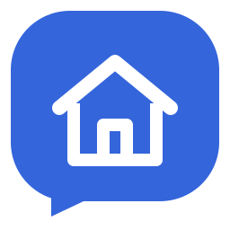

# Signal Messenger REST



Send Signal notifications, images and video from Home Assistant, receive messages for automations, and chat with Assist. Configure accounts, groups and linked devices through the UI.

Requires **Home Assistant 2026.9.1+** and a running [Signal Messenger add-on](https://github.com/haberda/signal-addon) or [Signal CLI REST API](https://github.com/bbernhard/signal-cli-rest-api).

## Install

1. Add this repository's public GitHub URL under **HACS → Custom repositories**, with type **Integration**.
2. Download **Signal Messenger REST** and restart Home Assistant.
3. Open **Settings → Devices & services → Add integration → Signal Messenger REST**.

For manual installation, copy `custom_components/signal_messenger_rest` into your Home Assistant `custom_components` directory and restart.

## Set up

1. Select a detected running Signal add-on, or enter the API URL reachable from Home Assistant. For an add-on, do not use `localhost`.
2. Select an existing Signal account, or link your phone using the displayed QR code and Signal's **Settings → Linked devices**.
3. Select notification destinations. Contacts, groups and **Note to self** are available; you can also enter recipient identifiers manually.
4. If you want incoming messages, enable receiving and select permitted senders. Group messages require both an allowed sender and an allowed group. Empty sender lists allow no incoming events.

Change these settings under **Configure → Destinations and receiving**. In polling modes (`normal`/`native`), disable other receivers and the backend's automatic receive schedule for that account.

## Send a notification

Each configured destination creates a notification entity. Select its actual entity ID in Home Assistant:

```yaml
action: notify.send_message
target:
  entity_id: notify.signal_household
data:
  message: The washing machine has finished.
```

For **images, video, custom recipients or quoted replies**, use `signal_messenger_rest.send_message`. See [attachment setup and examples](docs.md#sending-attachments-and-replies).

## More features

- [Assist conversations](docs.md#assist): select an agent, set permissions, and send `/assist turn on the kitchen lights`.
- [Camera notifications](docs.md#camera-notifications): send a snapshot, a video clip, or a snapshot followed by a clip.
- [Incoming messages and automations](docs.md#receiving-and-automations), including reactions and acknowledgment alerts.
- [Groups and linked devices](docs.md#accounts-groups-and-devices).
- [Troubleshooting](docs.md#troubleshooting) and [migration from the built-in integration](docs.md#migrating-from-the-built-in-integration).

[Usage guide](docs.md) · [Release notes](CHANGELOG.md) · [Development](CONTRIBUTING.md)

## AI assistance

This integration was created with AI assistance, including help with planning, implementation, documentation, and automated tests.
